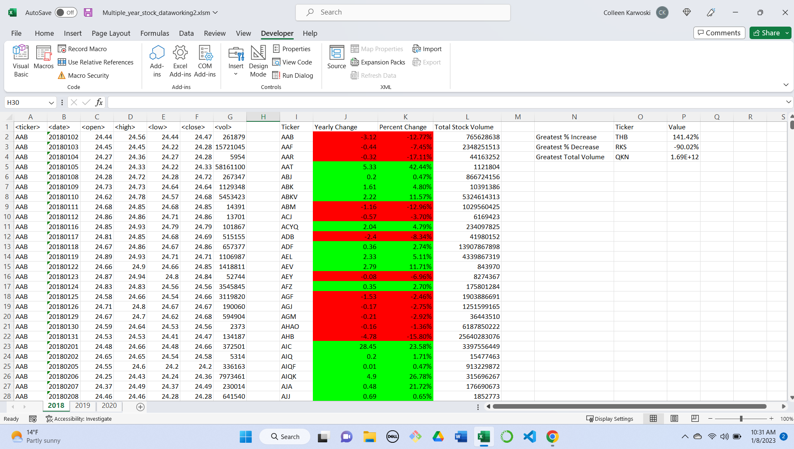
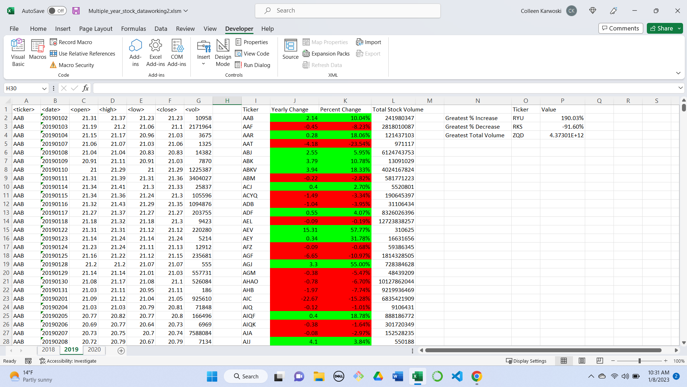
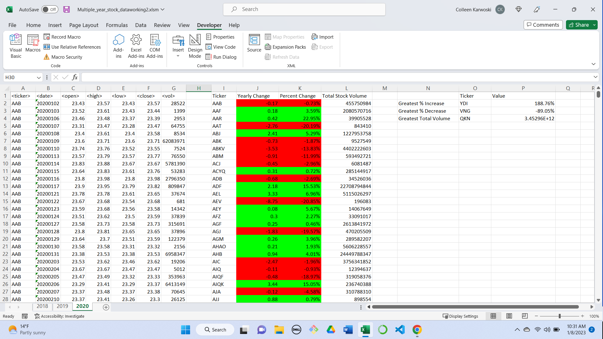

# VBA_Challenge

## Overview
Stock data was provided for 2018, 2019, and 2020. For each year, the data was organized to show each ticker symbol with its yearly change, percent change, and total stock volume. Positive change is shown in green and negative change is shown in red. Within each year, the stocks withthe greatest percent increase, greatest percent decrease, and greatest total volume were found and noted on the right hand side of the spreadsheet.

## Results

### 2018

In 2018, THB had the greatest % increase of 141.42%. RKS had the greatest % decrease of -90.02% and QKN had the greatest total volume.

### 2019

In 2019, RYU had the greatest % increase of 190.03%. RKS had the greatest % decrease of 91.60% and ZQD had the greatest total volume.

### 2020

In 2020, YDI had the greatest % increase of 188.76%. VNG had the greatest % decrease of 89.05% and QKN had the greatest total volume.
